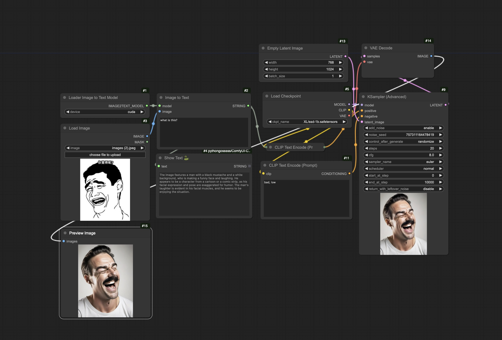

### 基础流程


### 使用图片和文字组合方式


### 第1步：安装插件

为了在ComfyUI中使用图片转换为提示（prompt）的功能，首先需要将插件的仓库克隆到您的ComfyUI `custom_nodes` 目录中。使用下面的命令来克隆仓库：

```bash
git clone https://github.com/zhongpei/Comfyui-image2prompt
```

完成这一步骤，您就可以在ComfyUI环境中启用此插件，从而高效地将图片转换为描述性提示。

### 第2步：下载模型

为了使插件正常工作，您需要下载必要的模型。该插件使用来自Hugging Face的 `vikhyatk/moondream1` `unum-cloud/uform-gen2-qwen-500m` 和 `internlm/internlm-xcomposer2-vl-7b` 模型。确保您已将这些模型下载到插件的 `model/moondream1` 和 `model/internlm-xcomposer2-vl-7b` 目录中。使用以下链接进行下载：

* [下载moondream1模型](https://huggingface.co/vikhyatk/moondream1)
* [下载internlm-xcomposer2-vl-7b模型](https://huggingface.co/internlm/internlm-xcomposer2-vl-7b)
* [下载uform-gen2-qwen-500m模型](https://huggingface.co/unum-cloud/uform-gen2-qwen-500m)

此外，如果您更喜欢使用镜像站点下载，可以将Hugging Face端点设置为镜像URL。在终端中执行以下命令以使用镜像：

```bash
export HF_ENDPOINT=https://hf-mirror.com
huggingface-cli download --resume-download vikhyatk/moondream1 --local-dir custom_nodes/Comfyui-image2prompt/model/moondream1
huggingface-cli download --resume-download internlm/internlm-xcomposer2-vl-7b --local-dir custom_nodes/Comfyui-image2prompt/model/internlm-xcomposer2-vl-7b
huggingface-cli download --resume-download unum-cloud/uform-gen2-qwen-500m --local-dir custom_nodes/Comfyui-image2prompt/model/uform-gen2-qwen-500m
```

按照这些步骤操作，您将确保插件能够访问所需的模型，从而准确地将图片转换为提示，增强您的ComfyUI体验。


### Step 1: Install the Plugin

To integrate the Image-to-Prompt feature with ComfyUI, start by cloning the repository of the plugin into your ComfyUI `custom_nodes` directory. Use the following command to clone the repository:

```bash
git clone https://github.com/zhongpei/Comfyui-image2prompt
```

This step is crucial for enabling the plugin within the ComfyUI environment, facilitating the efficient transformation of images into descriptive prompts.

### Step 2: Download the Model

For the plugin to function properly, you need to download the necessary models. This plugin utilizes the `vikhyatk/moondream1` `unum-cloud/uform-gen2-qwen-500m` and `internlm/internlm-xcomposer2-vl-7b` models from Hugging Face. Make sure to download these models into the plugin's `model/moondream1` and `model/internlm-xcomposer2-vl-7b` directories, respectively. Use the following links for downloading:

* [Download moondream1 Model](https://huggingface.co/vikhyatk/moondream1)
* [Download internlm-xcomposer2-vl-7b Model](https://huggingface.co/internlm/internlm-xcomposer2-vl-7b)
* [Download uform-gen2-qwen-500m Model](https://huggingface.co/unum-cloud/uform-gen2-qwen-500m)

Additionally, if you prefer using a chinese mirror site for downloading, you can set the Hugging Face endpoint to a mirror URL. Execute the following commands in your terminal to utilize the mirror:

```bash
export HF_ENDPOINT=https://hf-mirror.com
huggingface-cli download --resume-download vikhyatk/moondream1 --local-dir custom_nodes/Comfyui-image2prompt/model/moondream1
huggingface-cli download --resume-download internlm/internlm-xcomposer2-vl-7b --local-dir custom_nodes/Comfyui-image2prompt/model/internlm-xcomposer2-vl-7b
huggingface-cli download --resume-download unum-cloud/uform-gen2-qwen-500m --local-dir custom_nodes/Comfyui-image2prompt/model/uform-gen2-qwen-500m
```

By completing these steps, you'll ensure that the plugin has access to the necessary models, enabling it to accurately convert images into prompts, thereby enhancing your ComfyUI experience.